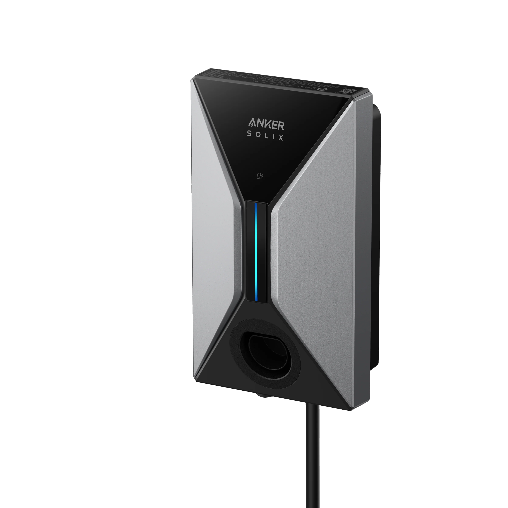

# Anker SOLIX V1 Smart EV Charger for Home Assistant

[![hacs][hacs-badge]][hacs-url]
[![release][release-badge]][release-url]
[![license][license-badge]](LICENSE)

Home Assistant integration for the **Anker SOLIX V1 Smart EV Charger** over
Modbus TCP — fully local, with no cloud and no Anker account. The charger
appears in Home Assistant as a single device carrying its measurements and
controls.



> **Status:** working, but young. Verified against an **A5191** (single-phase,
> 32 A, firmware 1.0.6.1). Reports from other variants are welcome — see
> [Contributing](#contributing).

---

## What it does

**Measurements** — charging power, energy and duration of the running session,
per-phase voltages and currents, active, reactive and apparent power, charging
status, CP signal, relay temperatures.

**Controls** — start and stop charging, limit the charging current between 6 and
32 A, boost mode, phase selection, Modbus timeout.

That is enough to drive the charger from automations: following PV surplus,
limiting current to what the house connection allows, or charging on a cheap
tariff.

## Requirements

* Home Assistant 2024.12 or newer
* An Anker SOLIX V1 Smart EV Charger on the same network (LAN or Wi-Fi)
* Modbus TCP enabled in the Anker app

### Enabling Modbus TCP

1. Open the Anker app, select **V1 Smart EV Charger**, tap **Settings**
2. Open **Integrations**
3. Turn on **Modbus TCP**

The app shows the IP address and port there. A fixed address via a DHCP
reservation on your router is recommended.

> **Only two clients at a time.** The charger accepts at most two concurrent
> Modbus connections. If an energy manager or a debugging tool is already
> connected, the integration may not get through. It therefore holds exactly one
> connection open instead of reconnecting for every poll.

## Installation

### HACS

Add this repository as a custom repository of type *Integration*, install
**Anker SOLIX V1 Smart EV Charger**, then restart Home Assistant.

### Manual

Copy `custom_components/anker_solix_v1` into your Home Assistant
`config/custom_components/` directory and restart.

## Configuration

*Settings → Devices & Services → Add Integration → Anker SOLIX V1*

Enter the IP address; port (`502`), device ID (`1`) and poll interval (5 s) are
prefilled. The integration verifies the connection and creates the device under
the charger's serial number.

The poll interval can be changed later under the entry's *Configure* option
(2–300 s).

## Entities

### Measurements

| Entity | Unit | Register |
|---|---|---|
| Charging status | — | 20097 |
| Charging state (plain text) | — | 20097 |
| Charging power | W | 20068 |
| Session energy | kWh | 20084 |
| Session duration | s | 20082 |
| Voltage L1-N / L2-N / L3-N | V | 20053–20055 |
| Voltage L1-L2 / L2-L3 / L3-L1 | V | 20056–20058 |
| Current L1 / L2 / L3 | A | 20059–20061 |
| Active power, total and per phase | W | 20062–20069 |
| Reactive power per phase | var | 20070–20075 |
| Apparent power per phase | VA | 20076–20081 |
| Phase mode, charging mode | — | 20087, 20088 |

### Status

| Entity | Type |
|---|---|
| Charging | Binary sensor |
| Vehicle connected | Binary sensor |
| Alarm | Binary sensor |
| Load balancing, solar balancing, PWM enabled | Binary sensor |

### Controls

| Entity | Type | Register |
|---|---|---|
| Charging | Switch | 21000 |
| Start charging / Stop charging | Buttons | 21000 |
| Charging current limit (6–32 A) | Number | 21001 |
| Boost mode | Switch | 21002 |
| Modbus timeout | Number | 21003 |
| Phase selection | Select | 21005 |

### Diagnostics

CP signal status, CP voltage, relay temperatures, LED brightness, OCPP and MQTT
connection status, rated power, maximum output current.

Diagnostic values and the entities for unused phases are created disabled;
enable the ones you need on the device page.

## Operating notes

**Poll interval.** Default 5 s, adjustable in the integration's options
(2–300 s). Plain monitoring is fine at 30 s; surplus charging wants 5 s.

**Modbus timeout.** Register 21003 sets how long the charger waits without
Modbus traffic before falling back to its own control strategy. Keep it well
above the poll interval; the factory setting is 120 s.

**Charging current below 6 A.** The charger pauses below 6 A, so the charging
current limit offers no lower values.

**Energy dashboard.** *Session energy* is reset by the charger at the start of
every session, so it is declared `TOTAL` rather than `TOTAL_INCREASING` —
otherwise Home Assistant would read each reset as a counter rollover.

## Using the data in other applications

Tools that read Home Assistant over the REST API — such as
[Leapmotor Mate](https://github.com/ProtossBlaster/leapmotor-mate) — always
receive the raw value of an `enum` sensor, never the translation: state
translations are applied by the HA frontend alone. *Charging status* therefore
arrives as `charger_paused` rather than "Paused by charger".

**Charging state (plain text)** exists for that case. It reads the same register
and collapses it onto four English terms, and carries no device class, so it is
delivered unchanged:

| Charging status | Charging state (plain text) |
|---|---|
| Charging | `Charging` |
| Preparing, paused by charger/vehicle, charging completed, reserving | `Connected` |
| Idle, disabled | `Idle` |
| Error | `Error` |

The sensor is created disabled; enable it on the device page. Inside Home
Assistant, *Charging status* remains the better choice — it is translated and
reports all nine states individually.

**Mapping in Leapmotor Mate** (*Settings → Wallbox*):

| Role | Entity |
|---|---|
| Charging power | *Charging power* (W) |
| Session energy | *Session energy* (kWh) |
| Status | *Charging state (plain text)* |
| Maximum charging current | *Charging current limit* |

Mate filters its picker by keywords such as `wallbox` or `charger` in the entity
name. If the device name contains neither, the entities will not show up on
their own: either add your own search terms under *Settings → Wallbox*, use the
*show all* mode, or rename the device in Home Assistant. Note that Mate infers
whether charging is active from the power reading (> 50 W), not from the status.

## Example automation

Following the charging current to the PV surplus:

```yaml
automation:
  - alias: Track PV surplus with the charger
    triggers:
      - trigger: state
        entity_id: sensor.pv_surplus
    conditions:
      - condition: state
        entity_id: binary_sensor.anker_solix_v1_vehicle_connected
        state: "on"
    actions:
      - action: number.set_value
        target:
          entity_id: number.anker_solix_v1_charging_current_limit
        data:
          value: >-
            {{ [[(states('sensor.pv_surplus') | float(0) / 230)
                 | round(0), 6] | max, 32] | min }}
```

## Register documentation

The register map is based on the document *Anker SOLIX V1 Smart EV Charger
Modbus Protocol* V1.0.0 (2025-11-30) and was verified against an A5191
(firmware 1.0.6.1). Seven points differ from the documentation and are recorded
in [`registers.py`](custom_components/anker_solix_v1/registers.py):

* **Function codes.** The documentation names none. In practice the block
  20000–20100 answers only to FC4 (input registers), and the block 21000–21005
  only to FC3/FC6 (holding registers).
* **Word order.** 32-bit values are big-endian. Shown by the rated power:
  `[0, 7400]` yields 7400 W, whereas little-endian would give 484,966,400 W.
* **Unit column.** Wrong for 21001, 21003 and 21005, while the gain column is
  right. 21001 = 320 matches the 32 A shown in the app. 20039 is affected too:
  the column says KVA, but the value 32 is the maximum output current in
  amperes.
* **Gain of the current registers.** For 20059–20061 the documentation says
  100; the correct value is 10. At 1388 W on L1 and 224.0 V, register 20059
  reads 62: 6.2 A gives 1388.8 W and thus the reported power, while 0.62 A
  would give only 138.9 W.
* **Reading back 21000.** The charge command is not stored: after stopping
  through the integration, 21000 reads 0 permanently, never the 2 that was
  written. The *Charging* switch therefore evaluates the charging status
  instead of the register.
* **Unit of the CP voltage.** The documentation names none; it is millivolts.
  Shown by three CP states within one session: 11779 at A, 8846 at B1 and 5826
  at C2 match the IEC 61851 targets (12/9/6 V) to within 0.25 V.
* **Connection status 20099 and 20100.** The two registers use different codes
  and are decoded separately: for OCPP (20099), 1 means *connecting* and 2
  *connected*, while for MQTT (20100), 1 already means *connected*. A shared
  mapping reported an established MQTT connection as "connecting" indefinitely.

The protocol document itself is copyrighted and may not be redistributed, so it
is not included in this repository. Anker provides it on request.

How to check register values against real hardware — and how to tell a sentinel
from a measurement — is described in
[docs/VERIFIZIEREN.md](docs/VERIFIZIEREN.md) (in German).

### Open points

| Point | Status |
|---|---|
| Relay 1 temperature | Reads a constant −55.0 °C (sentinel); the sensor appears not to be fitted on the A5191 |
| Alarm list (20041–20052) | Bit assignment not available |

The twelve alarm registers are combined into a single *Alarm* binary sensor,
with the raw values attached as attributes so that a bit assignment can be
added once the list becomes available.

## Changes

Every version and its changes are listed in the [changelog](CHANGELOG.md).

## Contributing

Reports from **three-phase units** and other model variants are especially
useful — verification so far covers only a single-phase A5191.

A bug report is most useful with the model number, the firmware version, an
excerpt from the Home Assistant log and, if possible, the raw values of the
registers involved.

Reading out those raw values is described in
[docs/VERIFIZIEREN.md](docs/VERIFIZIEREN.md) (in German).

## Disclaimer

This project is not affiliated with Anker Innovations Ltd. "Anker" and "Anker
SOLIX" are trademarks of their respective owners. Use at your own risk: the
integration can start and stop charging sessions and change the charging
current.

## License

[MIT](LICENSE)

[hacs-badge]: https://img.shields.io/badge/HACS-Custom-41BDF5.svg
[hacs-url]: https://hacs.xyz
[release-badge]: https://img.shields.io/github/v/release/ChristophGoth/ha-anker-solix-v1-modbus?display_name=tag
[release-url]: https://github.com/ChristophGoth/ha-anker-solix-v1-modbus/releases
[license-badge]: https://img.shields.io/badge/license-MIT-blue.svg
